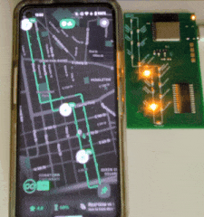
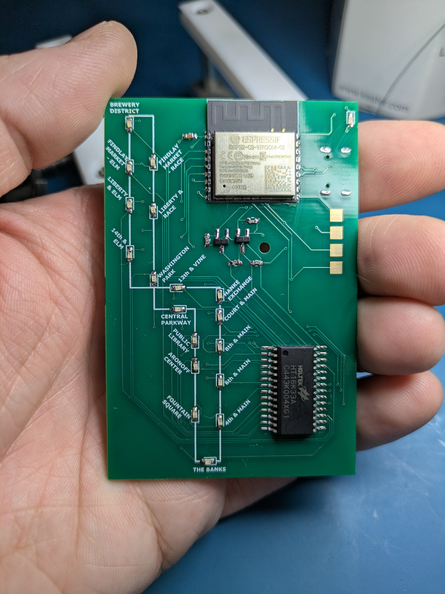
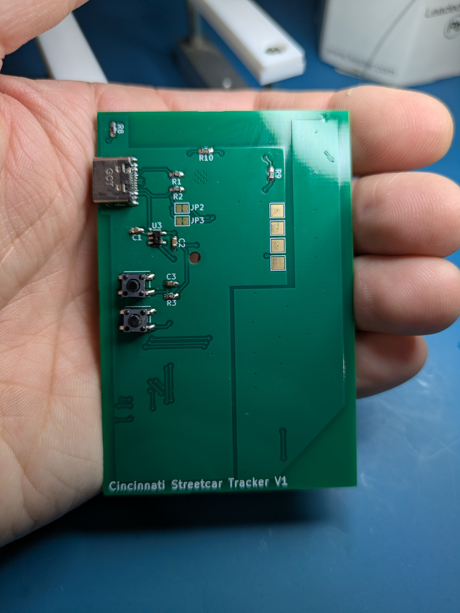

# Cincinnati Streetcar Tracker

I learned that the real-time transit information for the Cincinnati Streetcar was published by Metro here: https://www.go-metro.com/about/developer-data/ in [GTFS](https://en.wikipedia.org/wiki/GTFS) form. 

And then I saw https://www.traintrackr.io/ and was inspired to make a version for Cincinnati. 

